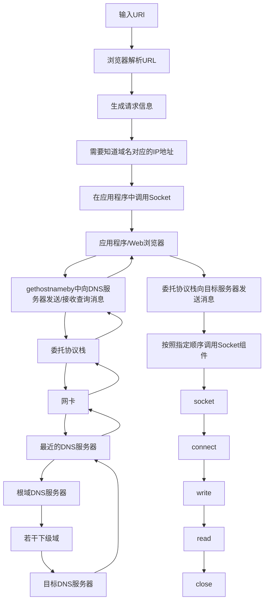
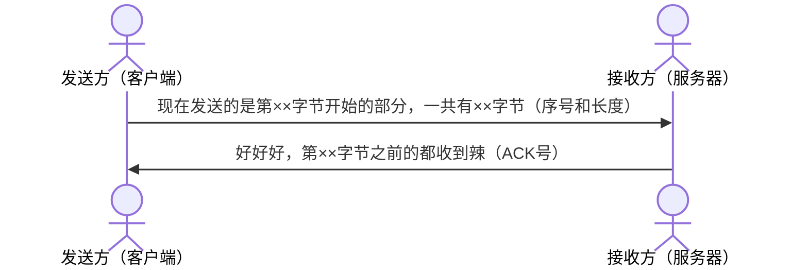
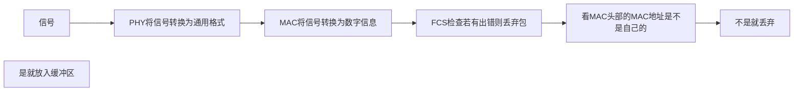

[toc]

# 《网络是怎样连接的》笔记😈

## 章节目录部分

1. Web浏览器
2. 协议栈、网卡
3. 集线器、交换机、路由器
4. 接入网、网络运营商
5. 防火墙、缓存服务器
6. Web服务器

## 第一章 浏览器生成消息  ——探索浏览器内部

## 1.1 要素察觉

（1）生成HTTP请求信息

（2）向DNS服务器查询Web服务器的IP地址

（3）全世界DNS服务器大接力

（4）委托协议栈发送消息

<br>

## 1.2 生成HTTP请求消息🧐

### 1.2.1 从输入网址开始

- 网址，准确来说叫URL，如 `https://www.bilibili.com/` 等。
- URL有各种各样，是因为浏览器除访问Web服务器外，还有在FTP服务器上下载和上传文件等功能。
- (FTP为*文件传送协议*)

### 1.2.2 浏览器要先解析URL

#### - URL的元素

> `https:` + `//` + Web服务器名 + `/` + ... + 文件名

其中

> `/` + ... + 文件名

表示数据源（文件）的路径名

例如

> [https://markdown.com.cn/basic-syntax/blockquotes.html](https://markdown.com.cn/basic-syntax/blockquotes.html)

---

#### - 省略文件名的情况

1. `http://www.lab.glasscom.com/dir/`

省略了dir下的文件名，表示访问服务器事先设置好的默认文件名，如 `index.html` 或 `default.html`

2. `http://www.lab.glasscom.com/`

表示访问一个名叫“/”的目录（根目录），由于省略，结果就是访问 `index.html` 或 `default.html`这样的文件

3. `http://www.lab.glasscom.com`

当如上没有文件名时，就代表访问根目录下事先设置的默认文件，其最早被叫做 **主页** *(home page)*

4. `http://www.lab.glasscom.com/whatisthis`

如果Web服务器上存在名为whatisthis的文件，则将其作为文件名处理；如果存在该名称的目录，则将其视为目录名来处理，*因为我们无法创建两个名字相同的文件和目录*  （做了解即可）

---

### 1.2.3 HTTP的基本思路

解析完URL之后，我们就知道应该要访问的目标在哪里了，接下来，浏览器会使用HTTP协议来访问Web服务器

---

#### HTTP协议

HTTP协议定义了客户端与服务器之间交互的消息内容和步骤。

- **客户端→服务器 发送请求消息**（包含“对什么”和“进行怎样的操作”两部分）

  - <dl>
      <dt>"对什么"，即 <i>URI</i> ：</dt>
      <dd>存放网页数据的文件名 </dd>
      <dd>一个CGI程序的文件名</dd>
    </dl>
  - <dl>
        <dt>"进行怎样的操作"，即 <i>方法</i> ：</dt>
        <dd>1. <i>GET方法</i>：获取URI指定的信息（根据URI的类型返回文件内容或程序输出结果）</dd>
        <dd>2. <i>POST方法</i>：从客户端向服务器发送数据，如发送表单填写的数据等</dd>
        <dd>（以上为常用方法，其他仅作了解）</dd><br>
        <dd>3. HEAD方法</dd>
        <dd>4. OPTIONS方法</dd>
        <dd>5. PUT方法</dd>
        <dd>6. DELETE方法</dd>
        <dd>7. TRACE方法</dd>
        <dd>8. CONNECT方法</dd>
      </dl>
- **Web服务器解析内容 并发送回客户端消息**

  - 通过URI和方法判断“对什么”和“进行怎样的操作”，完成相应工作后，将结果存放在响应消息中
  - 响应消息的开头有状态码（如200或404等），状态码后是头字段和网页数据
  - 响应消息会被发送回客户端，客户端收到之后，浏览器会从消息中读出所需数据并显示出来
  - 到此，HTTP的整个工作就完成了
- **HTTP方法补充**

  - GET方法

  访问Web服务器时，使用的就是GET方法。

  首先，在请求消息中写上GET方法，然后在URI中写上存放网页数据的文件名

  Web服务器收到后就会打开该文件并读取里面的数据，将其存放到响应消息中，最后返回给客户端

  - POST方法

  使用POST方法时，URI会指向Web服务器中运行的一个应用程序的文件名（如 `index.cgi`或 `index.php`等）

  然后，在请求消息中，除了方法与URI之外，还要加上传递给应用程序和脚本的数据（即在输入框里输入的信息）

  服务器收到消息后，会将请求消息中的数据发送给URI指定的应用程序，然后服务器再将运行结果信息存放到响应消息中返回给客户端

---

#### 生成HTTP请求消息

对URL进行解析后，浏览器确定了Web服务器和文件名，接下来就需要根据这些信息生成请求消息了

- **第一行 请求行**

  - 重点是开头的方法，即告诉浏览器进行怎样的操作
  - 通过请求行可以大致了解请求的内容，形如下方

  > <方法><空格><`URI`><空格><HTTP版本>
  >
- **第二部分 消息头**

  - 每行包含一个头字段，表示请求的附加信息
  - 常见头字段及其含义见书 p17-p19
- **第三部分 消息体**

  - 包含客户端向服务器发送的数据
  - 如果是GET的话就不需要填写消息体
  - 是POST的话就填写为输入的信息

---

#### 响应信息

后面还有相关内容，这里粗略写一下先

- **第一行 请求行**

  > <HTTP版本><空格><状态码><空格><响应短语>
  >
- **第二部分 消息头**

  - 每行包含一个头字段
- **第三部分 消息体**

  - 包含服务器向客户端发送的数据
  - 为文件中读取的数据或CGI程序输出的数据
  - 消息体的内容作为二进制数据来处理
- 网页中包含图片时，会在网页中相应位置嵌入表示图片文件的标签（``）的控制信息
- 浏览器会在显示文字时搜索相应标签，当遇到图片相关标签时，会在屏幕上留出来显示图片的空间
- 由于每条请求消息中只能写1个URI，每次只能获取1个文件，对每个文件单独发送1条请求
- 比如1个网页包含3个图片，那么获取网页加上获取图片，一共需要发送4条请求
- **PS：Web服务器完全不关心这些请求获取的文件是1个网页中的还是不同网页中的，它的任务只是对每一个请求返回响应**。排版布局什么的是浏览器的活😉

---

## 1.3 向DNS服务器查询Web服务器的IP地址

### 1.3.1 IP地址基本知识

生成HTTP消息后，需要委托操作系统将消息发送给Web服务器

**PS：浏览器能够解析网址并生成HTTP消息，但其不具备将消息发送到网络的功能，所以需要委托操作系统实现**

在进行这一操作时，还有一个工作需要完成，就是查询网址中服务器域名对应的IP地址，在委托操作系统发送消息时，**必须要提供**的不是通信对象的域名，**而是其IP地址**

---

#### 简单了解IP地址

- TCP/IP基本思路

  - 由一些小的子网，通过 *路由器* 连接起来组成一个大的 *网络*
  - 这里的子网可以理解为用 *集线器* 连接起来的几台计算机，我们将它看作一个单位，称为 *子网*
- IP地址

  - 在网络中，所有设备都会被分配一个地址，相当于现实中某条路上的“××号××室”
  - 其中“**号**”对应的号码是分配给整个子网的（**网络号**），而“**室**”对应号码是分配给子网中的计算机的（**主机号**），这个地址的整体称为 *IP地址*
  - 通过IP地址我们可以判断出访问对象服务器的位置，从而将消息发送到服务器
- 实际的IP地址

  - 实际的IP地址是一串 32 bit 的数字，按照 8 bit（即1 Byte）为一组分成四组，分别用十进制表示并用圆点隔开
  - 网络号和主机号连起来总共 32 bit ，但其具体结构是不固定的
  - IP地址主体的表示方法

  > 10.11.12.13
  >

  - 采用与IP地址主体相同格式表示子网掩码的方法

  > 10.11.12.13/**255.255.255.0**
  >

  - 采用网络号比特数来表示子网掩码的方法

  > 10.11.12.13/**24**
  >

  - 表示子网的地址(主机号部分的比特全部为0，该地址代表整个子网，而非单独的计算机)

  > 10.11.12.**0**/24
  >

  - 表示子网内广播的地址(主机号部分的比特全为1，表示对整个子网进行广播)

  > 10.11.12.**255**/24
  >

---

#### 子网掩码

- 作为另外的附加信息来表示IP地址的内部结构，**即将某个IP地址划分成网络地址和主机地址两部分**
- 其格式与IP地址相似，是一串与IP地址长度相同的32比特数字，左边部分都是1，右边部分都是0，**为1的部分表示网络号，为0的部分表示主机号**
- `255.255.255.0`的写法太长，我们可以把为1的部分的比特数`<i>` **(把255.255.255.0写成二进制形式，其中从左起有24位都为1，所以可用24表示其子网掩码)** `</i>`用十进制表示并写在IP地址右侧，如下

  > 10.11.12.13/**24**
  >

  |        |          |          |          |                        |
  | ------ | -------- | -------- | -------- | ---------------------- |
  | 十进制 | 255      | 255      | 255      | 0                      |
  | 二进制 | 11111111 | 11111111 | 11111111 | ***00000000*** |
  | 地址   | 网络地址 | 网络地址 | 网络地址 | 主机地址               |
- ***`255.255.255.0` 分析***`<br>`该子网掩码的二进制由24个1和8个0组成，8个0表示该子网掩码划分出的子网容量为256（2的8次方），也就是说 `10.11.12.0-255` 都在同一个子网中，***在这有256个地址的一个子网中，可用地址只有254个***，因为规定每个子网的第一个IP地址为**网段地址**（主机号全0表示整个子网），最后一个IP地址为**广播地址**（主机号全1表示向子网上所有设备发送包，即广播），都不可用。
- ***`255.255.255.252` 情况***`<br>`将该子网掩码转换成二进制为30个1和2个0，表示每个子网中只有4个IP地址（2的2次方），所以 `10.11.12.0-255` 的地址段共可划分64个子网，第一个子网的地址范围是0-3（主机号），第二个子网的地址范围是4-7（主机号），依次类推。其中每个子网第一个和最后一个IP地址又不可用，可用的只有2个IP地址。也就是说：如果子网掩码设置为 `255.255.255.252`，那么该子网只能容纳两台电脑，而且这两台电脑的IP必须在一个子网内才能正常联网，例如一台电脑的IP设为 `10.11.12.10`，另外一台电脑的IP必须设置为 `10.11.12.9`

  |        |          |          |          |                        |
  | ------ | -------- | -------- | -------- | ---------------------- |
  | 十进制 | 255      | 255      | 255      | 252                    |
  | 二进制 | 11111111 | 11111111 | 11111111 | 111111***00*** |
  | 地址   | 网络地址 | 网络地址 | 网络地址 | 主机地址               |
- 实际举例`<br>`某个小型公司有四个部门：行政、研发、营销、售后，每个部门各40台计算机接入公司局域网交换机，如果要在 `192.168.1.0`网段为每个部门划分子网，子网掩码应该怎么设置，每个子网的地址范围分别是什么？`<br><br>`解答：  `192.168.1.0`网段共256个地址，划分4个子网，每个子网需要64个地址；64是2的6次方，子网掩码应该以6个0结尾，剩下的用1补齐，由26个1和6个0组成，转换成十进制是 `255.255.255.192`；每个子网共64个IP地址，掐头去尾后可用地址只有62个，第1个子网的可用IP地址范围是：`192.168.1.1-62`，第2个子网可用IP地址范围是 `192.168.1.65-126`，第3个子网的可用IP地址范围是：`192.168.1.129-190`，第4个子网可用IP地址范围是 `192.168.1.193-254`

---

#### 域名和IP地址并用的理由

- 效率原因

  IP地址长度为32比特，即4个字节，而域名最短也要几十个字节，最多甚至255字节，这增加了路由器的负担，且其长度不固定，处理长度不固定的数据比长度固定是数据更为复杂
- 记忆原因

  IP地址没有网址好记忆
- 现状

  所以我们选择**让人来使用名称，让路由器使用IP地址**，这就需要一个机制能够通过名称查询IP地址，或者反过来，这个机制就是***DNS***（Domain Name System，域名服务系统），将服务器名称和IP地址进行关联是DNS最常见的用法

---

### 向DNS服务器查询

#### Socket库提供查询IP地址的功能

- 简单探索DNS

  - 我们向DNS服务器发送查询信息，并接受返回的响应消息，即对于DNS服务器，我们的计算机上一定有相应的DNS客户端，这一部分被称为 ***DNS解析器***
  - 通过DNS查询IP地址的操作叫做域名解析，负责执行解析（resolution）操作的就叫解析器（resolver）
  - 解析器实际上是一段程序，它包含在操作系统的Socket库中

---

#### 解析器

- 通过解析器向DNS服务器发出查询

  在应用程序中写上 `<内存地址> = gethostbyname(Web服务器的域名);`
- 解析器内部原理

  - 网络应用程序（当前场景即为浏览器）调用解析器时，程序控制流程就会转移到**解析器内部**
  - 之后解析器会生成查询消息发送给DNS服务器（发送消息操作并不是由解析器完成，而是委托**操作系统内部的*协议栈*（操作系统内部的网络控制软件）**来执行）
  - 解析器调用协议栈后控制流程再次转移，协议栈会执行发送操作，然后通过网卡将消息发送给DNS服务器，再类似地一步步将返回消息传给应用程序
  - 向DNS服务器发送消息时，也需要知道DNS服务器的IP地址，其已经作为TCP/IP的设置项目事先设置好了

## 1.4全世界DNS服务器大接力

### 1.4.1 DNS服务器的基本工作

- 来自客户端的查询消息包含以下三种

  - 域名

    服务器，邮件服务器（@后面的部分）的名称
  - Class

    最早设计DNS时，DNS在互联网以外的其他网络的应用也被考虑到了，Class就是用来识别网络的信息的。不过如今除了互联网并没有其他网络了，所以Class值为固定的 **IN**
  - 记录类型

    表示域名对用何种类型的记录，比如类型为A（Address）时，表示域名对应的是IP地址，类型为MX时，表示域名对应邮件服务器。对于不同的记录类型，服务器向客户端返回的信息也会不同
- DNS服务器上事先保存有前面3种信息对应的记录数据，查询时就是根据这些记录查找符合查询请求的内容

  | 域名         | Class | 记录类型 | 响应数据                |
  | ------------ | ----- | -------- | ----------------------- |
  | www.blabla   | IN    | A        | 192.0.2.226             |
  | glasscom.com | IN    | MX       | 10 mail.glasscom.com ① |
  | ...          |       |          |                         |

  这张表代表注册文件中记录的内容，其中的信息称为“资源记录”

  ①:域名glasscom.com对应的收件服务器（优先级、邮件服务器域名）
- DNS服务器的基本工作就是根据需要查询的域名和记录类型查找相关的记录，并向客户端返回响应消息

### 1.4.2 域名的层次结构

- 信息如何在DNS服务器上注册并保存

  - DNS服务器中所有信息都是按照域名，以分层次的结构来保存的，比如

  > www.lab.glasscom.com
  >

  这里的句点代表了不同层次之间的界限，域名中越靠右的位置表示层级越高，其中，相当于一个层级的部分称为 ***域***

  这种具有层次结构的域名信息会注册到DNS服务器中，每个域都是作为一个整体来处理，即**不能将一个域拆开来存放在多台DNS服务器中**，我们先假设一台DNS服务器中只存放一个域的信息

  - 我们可以在域的下面创建下级域，称为“子域”，例如对于一个公司域（`example.co.jp`）来说，需要为每一个事业集团配备一台DNS服务器，分别管理各事业集团的信息，但由于一个域是不可分割的，我们可以通过创建子域解决问题，即 `sub1.example.co.jp` 和 `sub2.example.co.jp`
  - 实际上，互联网中的域也是一样，通过创建下级的域来分配给不同的国家、公司和组织等，比如 `www.nikkeibp.co.jp`，最上层 `jp`代表国家的域，`co`是其国内进行分类的域，再下层 `nikkeibp`就是分配给某个公司的域，最下层 `www`就是服务器名称

### 1.4.3 寻找相应的DNS服务器并获取IP地址

#### 互联网中有数万台DNS服务器，我们采取以下办法

> ***将负责管理下级域的DNS服务器的IP地址注册到他们的上级服务器中，以此类推***。比如负责管理 `lab.glasscom.com` 这个域的DNS服务器的IP地址需要注册到 `glasscom.com` 域的DNS服务器中，以此类推。这样，我们就可以通过上级DNS服务器查询出下级DNS服务器的IP地址，也就可以向下级DNS服务器发送查询请求了

似乎 `com`，`jp`这些域（顶级域）就是最顶层了，但实际上并非如此。在互联网中，`com`和 `jp`的上面还有一级域，称为 ***根域***

根域一般在书写域名时被省略，如果要明确表示根域，应该在最后加个句点，如

> www.lab.glasscom.com.

- **注意**：我们需要将根域的DNS服务器信息保存在互联网中所有DNS服务器中。这样一来，任何DNS服务器都可以找到并访问根域DNS服务器了，然后再从顶级域往下找到下层的某台目标DNS服务器

---

#### 通过缓存加快DNS服务器的响应

有时候并不需要从最上级的根域开始找，DNS服务器有一个缓存功能，可以记住之前查询过的域名，如果要查询的域名和相关信息已经在缓存中，就可以直接从中得到信息，接下来的查询可以从缓存的位置向下进行

缓存信息具有一个有效期，超过时间会自动删除。且对查询进行响应时，DNS服务器会告知客户端响应结果是来自缓存中还是来自负责管理该域名的DNS服务器

## 1.5 委托协议栈发送消息😄

### 1.5.1 数据收发操作概览

知道了IP地址，就可以委托操作系统内部的协议栈向该IP地址，也就是我们要访问的Web服务器，发送消息了，要发送给服务器的HTTP消息是一种**数字信息**（digital data）

和向DNS服务器查询IP地址一样，这里也需要使用**Socket库的程序组件，需要按照指定的顺序调用多个程序组件**

收发数据的两台计算机之间连接了一条数据通道，数据沿着通道流动，最终到达目的地（数据的流动是双向的）。**管道并不是一开始就有的，在收发数据之前，双方需要先建立起管道**。

建立管道的关键在于两端的数据出入口，称为 ***套接字***。我们需要先创建套接字，将其连接起来形成管道，实际过程如下

1. 服务器一方先创建套接字，然后等待客户端向该套接字连接管道 （服务器程序一般在启动后就创建好套接字并等待客户端连接通道）
2. 客户端也会先创建一个套接字，从此延伸出管道，连接到服务器端的套接字

当数据发送完毕时，管道将被断开。其连接时由客户端发起，断开时可以由任意端发起，一方断开后，另一方也随之断开，然后套接字也会被删除，到此为止通信操作结束。

- **收发数据的操作总结为四个阶段**：

1. 创建套接字
2. 将管道连接到服务器端的套接字上
3. 收发数据
4. 断开管道并删除套接字

每个阶段，Socket库中的程序组件都会被调用，上面四个操作都是由协议栈执行的，Socket中的组件为桥梁角色，并无实质性操作，委托内容会原原本本传给协议栈，以下将Socket和协议栈看作一个整体

---

### 1.5.2 细说四个阶段🧐

- **创建！**`<br>`客户端创建套接字，调用Socket库的socket程序，创建完成后协议栈会返回一个***描述符***，用来识别不同套接字（比如我们同时打开两个浏览器窗口，有两个数据收发要进行，就会创建出两个不同套接字）

---

- **连接！**`<br>`调用connect，需要指定描述符，IP地址和端口号这3个参数
  - 根据描述符判断使用哪一个套接字与服务器连接
  - IP地址由查询DNS服务器得到
  - 端口号：准确的说，IP地址是分配给设备中安装的网络硬件的（如果一台设备安装了多个硬件，就会有多个IP地址），我们需要识别具体的套接字，仅IP地址是做不到的，端口号就是解决这样是问题的，**当同时指定IP地址和端口号时，就可以明确识别出某台具体计算机的某个具体的套接字**

    描述符是用来在一台计算机内部识别套接字的机制，端口号用来让通信的另一方能够识别出套接字的机制

---

- 传递！<br>调用write，指定描述符和发送消息（前面的HTTP请求消息），服务器执行接收操作，调用read，需要指定存放响应消息的内存地址（接收缓冲区），其位于应用程序内部

---

- 断开！<br>Web服务器发完消息后先断，断到客户端后，客户端的套接字也断，当浏览器调用read接收数据后，read会告知浏览器操作结束，连接断开，浏览器得知后也会调用close进入断开阶段

---

- 粗略的程序描述

1. 准备：`<描述符> = socket(<使用IPv4>, <流模式>, ...);`
2. 连接：`connect(<描述符>, <服务器的IP地址和端口号>, ...);`
3. 发送与接收：`write(<描述符>, <发送数据>, <发送数据长度>; ... <接收数据长度> = read(<描述符>, <接收缓冲区>, ...);`
4. 断开：`close(<描述符>);`

---

## 1.6 第一章的大致框架🥵



## 第二章 用电信号传输TCP/IP数据   ——探索协议栈和网卡

## 2.1 创建套接字

### 2.1.1 协议栈内部结构

- 协议栈***上半部分***有两块，分别是**负责用TCP协议收发数据的部分和用UDP协议收发数据的部分**，像浏览器、邮件等一般的应用都是用TCP，像DNS查询等收发较短的使用UDP（粗略）
- ***下半部分***是用IP协议控制网络包收发操作的部分，IP中还包括ICMP协议和ARP协议

  > ICMP用于告知网络包传送过程中产生的错误以及各种控制信息
  >
  > ARP用于根据IP地址查询相应的以太网MAC地址
  >

  - 协议栈内部结构简要图

  

  - TCP/IP软件采用分层结构

  ```mermaid
  graph TD;
  应用程序调用Socket中的解析器-->操作系统内部的协议栈-->网卡驱动程序-->硬件指网卡
  ```

  IP下面的网卡驱动程序负责控制网卡硬件，然后网卡负责完成实际的收发操作，也就是对网线中的信号执行发送和接收操作

### 2.1.2 套接字的实体

- 协议栈内部有一块用于存放控制信息的内存空间，记录用于控制通信操作的控制信息，例如**通信对象的IP地址、端口号、通信操作的进行状态等**
- **这些控制信息就是套接字的实体**，协议栈在执行操作时需要参阅这些信息
- 套接字中还要记录是否收到响应，以及发送数据后经过多长时间才能按照需要重新发送
- 总之，套接字中记录了控制通信操作的各种信息，协议栈需要通过这些信息判断下一步行动

在cmd中输入 `netstat -ano`查看套接字的部分内容如下：

| 协议 |    本地地址    |    外部地址    |    状态    |  PID  |
| :--: | :-------------: | :-------------: | :---------: | :---: |
| TCP |  0.0.0.0:3306  |    0.0.0.0:0    |  LISTENING  |  451  |
| TCP |  0.0.0.0:49668  |    0.0.0.0:0    |  LISTENING  | 4292 |
| TCP |  0.0.0.0:49674  |    0.0.0.0:0    |  LISTENING  |  984  |
| TCP |  127.0.0.1:53  |    0.0.0.0:0    |  LISTENING  | 4752 |
| TCP | 127.0.0.1:54530 |    0.0.0.0:0    |  LISTENING  | 9616 |
| TCP | 127.0.0.1:54533 |    0.0.0.0:0    |  LISTENING  | 10320 |
| TCP | 127.0.0.1:54533 | 127.0.0.1:63890 | ESTABLISHED | 10320 |
| TCP | 127.0.0.1:63890 | 127.0.0.1:54533 | ESTABLISHED | 4960 |
| TCP | 127.0.0.1:63891 | 127.0.0.1:63892 | ESTABLISHED | 10320 |
| UDP |   0.0.0.0:123   |      \*:\*      |            | 17104 |
| UDP |   0.0.0.0:500   |      \*:\*      |            | 4912 |
| UDP |  0.0.0.0:3702  |      \*:\*      |            | 4024 |

1. 本地地址列：**IP地址:端口号**，其中0.0.0.0表示不绑定IP地址
2. 外部地址列：0.0.0.0表示还没有开始通信，没有绑定IP地址和端口号，其中UDP行的该列 `*:*`，因为UDP协议中套接字不绑定对方的地址和端口
3. 状态列：LISTENING表示等待对方连接，ESTABLISHED表示完成连接并正在进行数据通信
4. PID：进程标识符，可以在任务管理器中查看PID对应的程序

### 2.1.3 调用socket时的操作

- 创建套接字时，首先分配一个套接字所需的内存空间，然后向其中写入初始状态，并将其对应的描述符告知应用程序

## 2.2 连接服务器

### 2.2.1 连接的意思

连接实际上是通信双方交换控制信息，在套接字中记录这些必要信息并准备数据收发的一连串操作

- 客户端这边，连接操作的目的之一也是**把服务器的IP地址和端口号等信息告知协议栈**，刚创建完套接字时里面还没有存放数据，也不知道通信对象是谁
- 服务器角度，服务器上的套接字也不知道对象是谁，而且，与客户端不同，服务器上的应用程序也不知道对象是谁，所以，**我们需要让客户端告知服务器一些必要信息**，客户端向服务器传达开始通信的请求，也是连接的目的之一
- 执行数据收发操作时，我们还需要一块临时存放数据的内存空间，称为**缓冲区**，它也是在连接操作的过程中分配的

### 2.2.2 负责保存控制信息的头部

#### 控制信息有两类

1. 客户端与服务器相互联络时交换的控制信息

   这些信息在整个通信过程都需要，在TCP协议的规格中进行了定义，这些字段是固定的，**这些信息会被添加在客户端与服务器之间传递的网络包的开头**，称为**头部**
2. 保存在套接字中，控制协议栈操作的信息

### 2.2.3 连接操作的实际过程

这个过程从应用程序调用connect开始

> connect(<描述符>, <服务器IP地址和端口号>, ...)

该调用提供了<描述符>, <服务器IP地址和端口号>等信息，这些信息会传递给协议栈中的TCP模块，然后，TCP模块会与该IP地址对应的对象，即服务器的TCP模块交换控制信息

- 客户端先创建一个包含开始数据收发的控制信息的头部（包括发送与接收方的端口号），到此，客户端的套接字就准确找到了服务器的套接字，也就明白了应该连接哪个套接字
- 然后我们将头部的控制位的SYN比特设置为1，表示连接
- TCP头部创建后，TCP模块会将信息传递给IP模块并委托其进行发送，IP模块执行包的发送后，包通过网络到达服务器，然后，**服务器上的IP模块会将接收到的数据传递给TCP模块，服务器的TCP模块根据传过来的头部信息找到端口号对应的套接字**


- 找到对应套接字之后，套接字中会写入相应信息，并把状态改为正在连接
- 服务器TCP模块返回响应，与客户端一样，要在TCP头部中设置发送与接收方端口号及SYN比特，此外还需要将ACK设置为1，表示已经接收到包，之后的传递过程与客户端→服务器类似
- SYN为1表示连接成功，这时会像套接字中写入服务器的IP地址、端口号等，同时将状态改为连接完毕
- 刚才服务器将ACK设置为1，相应的，客户端也需要将ACK设为1并发回服务器，告诉服务器刚才的响应已经收到，当服务器收到这个返回包时，连接操作才算全部完成

现在，套接字已经进入随时可以收发数据的状态了，在调用close之前，连接是一直存在的。建立连接之后，协议栈的连接操作就结束了，控制流程被交回应用程序


## 2.3 收发数据

### 2.3.1 将HTTP请求消息交给协议栈

数据收发操作是从应用程序调用write开始的

#### 发送数据时机判断

- MTU（最大传输单元）：一个网络包的最大长度（包含头部）
- MSS（最大分段大小）：除去头部之后，一个网络包中所能容纳的TCP数据长度

**当应用程序收到的数据长度超过或接近MSS时再发送出去**，避免发送大量小包降低效率（发送前先存放在协议栈内部的发送缓冲区）

同时也会**以时间为判断要素**，协议栈内部有一个计时器，达到一定时间后就会把网络包发送出去

协议栈**也给应用程序保留了控制发送时机的余地**，应用程序在发送数据时可以指定一些选项


### 2.3.2 对较大数据进行拆分

数据超过MSS长度时，拆分出来的每块数据放进单独的网络包中，发送时，在每块数据前加上TCP头部，根据套接字中的控制信息标记发送和接收方的端口号，然后交给IP模块执行发送数据


### 2.3.3 使用ACK号确认网络包已收到

TCP具备确认对方是否成功收到网络包，以及没收到时重发的功能，因此在发送操作后需要进行确认

#### 确认原理

TCP在拆分数据时会先计算好每块数据相当于从头开始的第几个字节，然后在在发送时将算好的字节数也写在TCP头部中，“序号”字段就是用在这里的，这些信息还能用来检查是否有发送遗漏，比如上次接收到第1460字节，接下来应该收到序号1461的包，反之则说明有遗漏

接收方还会计算出一共收到了多少字节，并将其写入TCP头部的ACK号中返回给发送方**（确认响应）**（返回ACK号时，除了要设置ACK号的值以外，还要将控制位中的ACK比特设为1，表示ACK字段有效，接收方也就可以知道这个包是用来告知ACK号的）



确认的原理示意图：

但实际上序号并不从1开始（容易被攻击），所以初始值被设为随机数，且需要将其告知通信对象，即将SYN控制位设为1（同时设置序号字段的值）并发送给服务器的操作


双向的数据传输也是类似的

序号和ACK号的交互：


TCP采用这样的方式确认对方是否收到数据，在得到对方确认之前，发送过的包都会保存在发送缓冲区，如果对方没有返回某些包对应的ACK号，那么就重新发送这些包。基于这一机制，我们不需要在其他地方采取补救措施了，真是强大的机制啊🥵

### 2.3.4 根据网络包平均往返时间调整ACK号等待时间

#### 返回ACK号的等待时间

要考虑ACK号返回的时长可能受网络情况变长与如果丢包需要重传的等待时间

TCP采用动态调整的方法，TCP会在发送数据的过程中持续测量ACK号的返回时间，如果ACK号返回变慢，就相应延长等待时间；反之，则减少等待时间

### 2.3.5 使用窗口有效管理ACK号

- 一来一回方式

每发送一个包，就等待一个ACK号，等待的时间被浪费

- 滑动窗口方式

发送之后不等待ACK号返回，继续发送后面的包，但可能出现发送频率超过接收方处理能力的情况

接收方的TCP收到包后，会将数据先存放到缓冲区，然后接收方需要计算ACK号，再将数据组装起来还原，并传给应用程序，如果这些操作还没完成下一个包就到了，下一个包会被暂存在缓冲区，缓冲区**溢出**后就会出错

解决方法：接收方先告诉发送方自己的最大接收量（TCP**调优参数**：**窗口大小**）。接收方将数据暂存并执行接收，接收完毕后，缓冲区空间释放，接收方通过TCP头部中的窗口字段将自己能接收的数据量告知发送方

### 2.3.6 ACK与窗口的合并

要提高收发数据的效率，还有问题需要考虑：返回ACK号和更新窗口的时机

**更新窗口的时机**：从缓冲区取出数据传给应用程序时，此时窗口大小变化，缓冲区剩余容量增加，需要告知发送方

**ACK号**：收到数据后就返回ACK号

综上，发送方数据到达接收方后，先发送了一个ACK号的包，过一段时间数据传递给应用程序后，再发出更新窗口的包，影响效率😫

因此，接收方在发送ACK号和窗口更新时，并不会马上把包发出去，而是等待一段时间，在这期间还可能会出现其他通知操作，这样就可以把两种通知合在一起发送。例如，当连续发送多个ACK号时，就可以减少包的发送量，因为ACK号表示的是已收到的数据量，只说明接收的数据的最后的位置，只发送最后一个ACK号就可以，连续发送多个窗口更新也是同理；等待ACK号发送时正好更新窗口，也可以放在一起发送

### 2.3.7 接收HTTP响应消息

浏览器在委托协议栈发送消息后，会调用read程序获取响应消息

- 协议栈尝试从接收缓冲区中取出数据传给应用程序，但此时请求消息刚刚发出，响应消息可能还没返回，在等待的时间中，接收缓冲区中并没有数据，那么接收操作也无法继续
- 这时协议栈会将应用程序的委托挂起（暂停），等服务器返回的响应消息到达后再继续执行接收操作

## 2.4 从服务器断开并删除套接字

### 2.4.1 数据发送完后断开连接

完成数据发送的一方会发起断开过程，以服务器发起为例

- 服务器一方的应用程序会调用close，然后服务器的协议栈会生成包含断开信息的TCP头部（控制位中FIN设为1），接下来委托IP模块向客户端发送数据，同时，服务器的套接字中也会记录下断开操作的相关信息

- 客户端收到FIN为1的TCP头部时，其协议栈会将自己的套接字标记为进入断开状态，然后向服务器返回一个ACK号，等应用程序调用read来读取数据

- 协议栈告知应用程序（浏览器）来自服务器的数据都收到了，根据规则，只要收到服务器返回的所有数据，客户端操作也就随之结束了，客户端应用程序会调用close来结束收发操作
- 这时客户端的协议栈也会和服务器一样，生成一个FIN为1的TCP包，发给服务器，等服务器返回ACK号后，两端的通信就彻底结束了

### 2.4.2 删除套接字

套接字会等待一段时间后删除，是为了防止误操作，如果最后返回的ACK号丢失，其中一方会重发一遍FIN，此时若原套接字已经删除，碰巧别的地方创建了新的套接字且碰巧分配了原来的端口号，就会发送错误

### 2.4.3 数据收发操作小结


## 2.5 IP与以太网的包收发操作

### 2.5.1 包的基本知识

包由头部与数据两部分构成


包首先被发往最近的网络转发设备，然后会根据头部信息判断接下来转发到哪里。转发设备中有一张**记录了什么地址要往哪里发的表**，包就这样被一次次转发，最终到达接收方。

并不需要明确区分发送方与接收方，统称他们为**终端节点**，转发设备称为中间节点

- 路由器根据目标地址判断下一个路由器的位置
- 集线器在子网中将网络包传输到下一个路由

实际上，集线器是按照以太网规则传输包的设备，路由器是按照IP协议传输包的设备

- 发送方将包的目的地，也就是要访问的服务器的IP地址写入IP头部（并保持不变）
- IP协议就可以根据地址查找传输方向，从而找到下一个路由器的位置（R1）
- IP协议委托以太网协议将包传输过去，IP协议会查找R1的以太网地址，将其写入MAC头部，以太网协议就会知道发到哪了

前面讲了IP和以太网的分工，其中以太网的部分可以替换，如无线局域网等，可以替代以太网的角色帮助IP协议传输，因此将IP和负责传输的网络分开，更具灵活性

### 2.5.2 包收发操作概览

实际上将包从发送方传输到接收方的工作是由集线器。路由器等设备完成的，IP模块仅是整个过程的入口

- 收发操作的起点是TCP委托IP发送的操作，即TCP在数据块前加上TCP头部发给IP（在里面也要写清楚对象的IP地址）
- 收到委托后，IP模块会将其作为一整块数据，在前面加上IP头部和MAC头部，此时一个包就封装好了
- 封好的包会被交给网络硬件（这里称网卡），传递给网卡的是0和1的信息，网卡会将其转换成电信号或光信号，通过网线（或光纤）发送出去，到达集线器路由器等转发设备，再逐步转发出去
- 接收信息的过程正相反

TCP在收发数据时会分为好几个阶段，并为各个阶段设计了实现相应功能的网络包，但IP的收发操作都是相同的，无论是数据包还是控制包，IP的任务仅仅是将委托的东西打包送过去，或者将对方的包收过来

### 2.5.3 生成包含接收方IP地址的IP头部

IP头部中最重要的就是IP地址，这个地址是由TCP告知的（TCP是在连接操作时从应用程序处获取），因此地址的最初来源就是应用程序，IP不会自行判断目的地，只是将包发送给应用程序指定的接收方

IP头部中还要写发送方的IP地址，一台计算机可能有多个IP地址（一个网卡对应一个IP地址），我们需要判断写哪个地址，即判断用哪一块网卡，也就是判断发往哪个路由器，因此只要确定目标路由器即可

- 类似路由器使用IP表判断下一个路由器的位置，IP模块与路由器中负责包收发的部分，都是根据IP协议进行收发操作的，这个IP表叫做**路由表**（第三章）

### 2.5.4 生成以太网用的MAC头部

生成MAC头部时设置三个字段就可以了

- 以太类型，使用的协议类型，一般在TCP/IP中只使用0800和0806
- 发送方MAC地址，这里填写网卡本身的MAC地址，在网卡生产时就写入ROM里的
- 接收方MAC地址，首先在路由表中找到把包发给谁，找到其IP地址，再根据IP地址查询MAC地址

### 2.5.5 通过ARP查询目标路由器的MAC地址

ARP：地址解析协议

ARP利用广播对所有设备提问，就会得到回答，如果对方和自己处于一个子网，通过广播查询就可以得到对方的MAC地址（如果路由表设置正确，那么对方应该就在同一子网，否则无法做出ARP响应，只能认为对方不存在，即发送失败）

查询结果会放在**ARP缓存**的空间，查询时先在这里面查找，可以减少ARP包的数量，提高效率，但是会在一段时间后删除，为保持地址的有效性（地址可能发生变化）

### 2.5.6 以太网基本知识

- 以太网原型

以网线为主体，通过收发器将不同网线的信号连接起来。当一台计算机发出信号时，信号通过网线流过整个网络，最终到达所有设备，通过头部信息判断接受者，其他设备则丢弃这个包

- 中继式集线器
- 交换式集线器

现在信号只会根据MAC地址流到指定设备

**以太网三个性质**

- 将包发送到MAC头部的接收方MAC地址代表的目的地
- 用发送方MAC地址识别发送方
- 用以太类型识别包的内容

### 2.5.7 将IP包转换成电或光信号发送出去

IP生成的网络包只是一串数字信息，没法直接发送给对方，我们需要将其转换为电或光信号，才能在网线上传输，这才是真正的数据发送过程

负责执行这一操作的是网卡，还需要网卡驱动程序


网卡的ROM中保存着唯一的MAC地址，这是在生产网卡时写入的

网卡中保存的MAC地址会由网卡驱动程序读取并分配给MAC模块

### 2.5.8 给网络包再加3个控制数据

网卡驱动从IP获取包后，将其复制到缓冲区，然后向MAC模块发送发送包的命令

MAC模块将包从缓冲区取出，在开头加上**报头**和**起始帧分界符**（SFD），结尾加上用于检测错误的**帧校验序列**（FCS）

报头是形如101010101这样的1和0交替出现的比特序列，长度56比特，用来确定包的读取时机，这些序列会转换为波形，SFD的最后两个比特为11，波形与前面不同，网卡将这里作为起始位置

**用电信号表达数字信息时**，我们需要让0和1两种比特分别对应特定的电压和电流，所以通过测量信号中的电压与电流变化，可以还原出0和1两种比特值，但当0或1连续出现时，我们需要一个方法判断出每个比特的界限在哪里，为此我们引入了**时钟信号**

时钟信号从下往上变化一次就对应一个0或1，但是当距离较远时，两条线路信号的传输会有时差，为此我们进一步提出，采用将数据信号与时钟信号叠加的方法

时钟信号是按固定频率变化的，只要能找到变化周期，我们就可以从叠加信号中提取时钟信号，进而计算出数据信号，因此我们需要一个方法判断时钟信号的周期，所以我们不能一开始就发送包的数据，而是要在前面加上一段测量时钟信号的特殊信号，**报头**（但是具体怎么测量法书上也没说😣好奇，暂且先搁置一下😩）

末尾的FCS用来检查包传输过程中因噪声导致的波形紊乱、数据错误等，它是一串32比特的序列，通过一个公式对包中从头到尾的所有内容进行计算得出，当原始数据的某一个比特发生变化时，计算结果也会发生变化

### 2.5.9 向集线器发送网络包

加上报头，SFD和FCS后，我们就可以将包通过网线发送出去了，发送信号的操作分两种：使用集线器的半双工模式和使用交换机的全双工模式

> 发送和接收同时并行的方式叫全双工，同一时刻只能进行其中一种操作的叫半双工

**半双工模式**中，为避免信号碰撞，首先要判断网线中是否存在其他设备发送的信号，如果有，则需要等待。发送时，MAC模块从报头开始将数字信息按每个比特转换成电信号，然后由PHY（物理层装置），或者叫MAU（介质连接单元）的信号收发模块发送出去，其中将数字信息转换为电信号的速率就是网络的传输速率，例如每秒将10MBit的数字信息转换为电信号发送出去，则速率就是10MBit/s

接下来PHY（MAU）会将信号转换为可在网线上传输的格式并通过网线发送出去

网卡的MAC模块生成通用信号，然后由PHY模块转换成可在网线中传输的格式，并通过网线发送出去

PHY还负责监控接收线路中有没有信号进来，在发送信号的过程中，接收线路不应该有信号进来，产生信号碰撞时会发送阻塞信号，时所有发送操作停止，等待一段时间后（时间随机），网络中的设备会重发信号

### 2.5.10 接收返回包



到这里MAC模块的工作就完成了，接下来网卡会通知计算机收到了一个包（网卡不通知计算机是不知道的），通知计算机的操作会使用一个叫做**中断**的机制，即打断计算机正在执行的任务

**中断，是这样的**：

1. 网卡先向扩展总线中的中断信号线发送信号，该信号线通过计算机中的中断控制器连接到CPU，产生中断信号时，CPU会暂时挂起正在处理的任务，切换到操作系统中的中断处理程序，其会调用网卡驱动，控制网卡执行相应的接收操作。
2. 网卡驱动被中断处理程序调用后，会从缓冲区取出收到的包，通过MAC头部的以太类型判断协议类型，根据不同类型再交给不同的协议栈（如TCP/IP协议栈和AppleTalk协议栈等）

### 2.5.11 将服务器的响应包从IP传递给TCP

错误信息处理（略）（懒得写了）

**IP协议的分片**功能：网线和局域网中只能传输小包，因此需要将大的包切分成多个小包，分片的包会在IP头部的标志字段中进行标记，收到分片的包时，IP模块会将其暂存，等待具有相同ID的包全部到达（同一个包的分片都具有相同的ID）。IP头部中还有一个**分片偏移量**字段，表示当前分片在整个包中所处的位置，根据这些信息，在所有分片全部接收后，就可以将其还原成原始的包，即**分片重组**

接下来包会交给TCP模块，TCP会根据IP头部中接收方和发送方IP地址，和TCP头部中的二者端口号来查找对应的套接字

## 2.6 UDP协议的收发操作

内容来自ChatGPT（懒🥱）

UDP（User Datagram Protocol）是一种无连接的传输协议，与TCP（Transmission Control Protocol）相比，它具有以下特点：

1. 无连接性：UDP不需要在发送数据之前建立连接，因此传输速度更快。
2. 低延迟：UDP没有拥塞控制机制，数据包不会被缓存或重新排序，因此适合实时应用，如音频和视频流媒体。
3. 简单性：UDP的头部开销较小，协议本身相对简单，实现和管理相对容易。

基于这些特点，以下情况下更适合使用UDP协议传输：

1. 实时性要求高：当数据传输的实时性要求高于可靠性时，例如实时游戏、语音通话或视频直播，UDP更适合。虽然UDP不保证数据包的顺序和可靠性，但可以通过应用层的控制手段来处理丢包和顺序问题。
2. 数据量较小：由于UDP没有流量控制和拥塞控制机制，数据包的大小对传输效率影响较大。因此，当数据量较小且对实时性要求高时，UDP的开销更小，传输更高效。
3. 网络环境稳定：UDP不提供拥塞控制和重传机制，因此对网络环境要求相对较稳定。如果网络丢包率高，UDP传输可能会导致数据丢失。

需要注意的是，由于UDP不保证可靠性和顺序性，因此在某些应用场景中，如文件传输、电子邮件等对数据完整性和顺序性要求较高的情况下，更适合使用TCP协议。

UDP协议在传输数据时，由于缺乏可靠性保证的机制，可能会遇到一些意外情况。以下是UDP如何处理一些常见意外情况的方式：

1. 丢包：当发送的UDP数据包在传输过程中丢失时，UDP协议不会进行重传操作。在应用层可以通过实现自定义的丢包检测和处理机制来处理丢包问题，例如使用应答机制，如果发送的数据包一定时间内没有收到对应的应答，可以进行重发。
2. 乱序：由于UDP协议不保证数据包的顺序，数据包可能在传输过程中乱序到达。在接收端，应用程序可以通过在数据包中添加序号或时间戳等信息，并在接收后进行排序和重组，以确保数据包按正确的顺序处理。
3. 延迟：UDP协议没有拥塞控制机制，因此在网络拥塞时可能会出现延迟。对于实时性要求较高的应用，可以通过采用合适的网络传输策略、调整数据包大小、优化网络拓扑等方式来减少延迟。
4. 数据完整性：UDP协议不提供数据完整性的校验和修复机制。在应用层，可以通过在数据包中添加冗余校验和，如CRC（循环冗余校验），来验证数据的完整性，并在接收端检测和丢弃损坏的数据包。

需要注意的是，UDP协议本身并不提供对这些意外情况的处理机制，而是由应用程序在上层实现相应的处理逻辑。具体的处理方式会因应用需求的不同而有所不同。

## 第三章 从网线到网络设备——探索集线器、交换机和路由器

## 3.1 信号在网线和集线器中传输

### 3.1.1 每个包都是独立传输的

### 3.1.2 防止网线中的信号衰减很重要

从信号流出网卡进入网线开始，网卡的PHY模块直接连接RJ-45接口，信号从这个接口中的1号和2号针脚流入网线，信号通过网线到达集线器的接口，这个过程就是单纯的传输电信号

集线器收到的信号有时会衰减，网线越长，信号衰减越严重，信号损失能量并非只是变弱而已，前面讲过以太网中的信号波形是方形的，但损失能量会让信号的拐角变圆，因为电信号的频率越高，能量的损失率越大（高频信号会释放更多电磁波，这些电磁波带走了一部分能量），信号的拐角代表电压剧烈变化，损失一部分能量后，其变化就会相对缓慢

再加上信号失真等噪声进一步干扰，出现0和1的误判，就产生了通信错误

### 3.1.3 “双绞”是为了抑制噪声

局域网网线使用双绞线，即以两根为一组缠绕在一起，为了抑制噪声，but how?

产生噪声的是网线周围的电磁波，当电磁波接触到金属导体等，就会在其中产生电流，继而产生噪声

影响网线的电磁波有两种，**一种由电机、荧光灯、CRT显示器等设备泄露出来的电磁波，其来自网线外的设备**。see how 双绞线 suppress it：信号线由金属做成，当电磁波接触信号线时，会沿电磁波传播的右旋方向产生电流，当我们使用双绞线时，信号线变成螺旋形，这两根绞合而成的blabla...总之就是抵消了

> (来自ChatGPT)绞合结构：双绞线的两根导线以特定的方式绞合在一起，这种绞合结构可以使两根导线的电磁场互相抵消。当外部电磁场作用于双绞线时，它们会对两根导线产生相反的影响，从而减少噪声的干扰

另一种电磁波是从网线中相邻的信号线泄露出来的，称**串流**，抑制方式关键在于双绞缠绕方式，在一根网线中，每一对信号线的扭绞间隔（节距）都有一定差异，这使得某些地方正信号线距离近，另一些地方则是负信号线距离近，正负信号线产生的噪声是相反的，所以两者就会相互抵消

### 3.1.4 集线器将信号发往所有线路

略（懒得看，看不懂，后面再说😭）

## 3.2交换机的包转发操作 

### 交换机根据地址表进行转发

